# 扬帆测试平台

- [使用文档](https://yangfan.gd.cn/)
- 前后端采用[gin-vue-admin](https://www.gin-vue-admin.com/), Gin + Vue全栈开发基础平台
- 测试引擎采用[HttpRunner V5](https://httprunner.com/),支持 HTTP(S)/HTTP2/WebSocket/RPC 等网络协议，涵盖接口测试、性能测试、数字体验监测等测试类型。简单易用，功能强大，具有丰富的插件化机制和高度的可扩展能力。

#  V2支持功能
- [x] 用户管理：用户新增/编辑/禁用、角色关联、基础信息维护
- [x] 项目管理（项目管理 → 项目配置）：项目创建/配置、CI 密钥配置、项目级参数沉淀
- [x] 项目成员与权限（项目管理 → 项目成员与权限）：成员加入/移除、项目内权限分配与管理

- [x] 配置管理（配置管理 → 运行配置）：运行参数配置（如默认运行策略/公共配置项等）
- [x] 环境变量管理（配置管理 → 环境变量管理）：环境变量分组维护、环境切换、运行时引用
- [x] 运行节点（配置管理 → 运行节点）：运行节点查看与管理（为分布式/多节点运行做准备）

- [x] 函数插件（配置管理 → 函数插件）
  - python 函数（函数插件 → python 函数）：维护可复用的 python 函数能力，供用例/步骤引用
  - 调试信息（函数插件 → 调试信息）：查看函数/运行相关调试信息，辅助定位执行问题
  - py 第三方库（函数插件 → py 第三方库）：第三方依赖管理与安装，运行环境能力扩展

- [x] 接口自动化（接口自动化）
  - 接口管理：接口信息维护（接口定义、请求配置等）
  - 测试步骤：步骤编排与复用，支持按步骤组织用例执行流程
  - 测试用例：用例编排与维护，覆盖常见接口自动化测试场景
  - 定时任务：定时执行用例/任务，支持回归与例行巡检类任务
  - 自动报告：运行结果汇总与报告管理；支持进入运行报告详情页查看单次执行细节

- [x] 数据仓库（数据仓库 → 数据分类）：测试数据分类管理，为数据沉淀与复用提供基础结构

## V1支持功能
- [x] 用户管理
- [x] 项目管理，用户在项目的权限、CI密钥设置
- [x] 环境管理
- [x] 接口管理
- [x] 测试用例管理
- [x] 用例之间的数据传递：请求头和参数导出
- [x] 定时任务
- [x] 通过标签运行定时任务(可用户发版时做全量回归)
- [x] 定时任务并发执行，定时任务可以根据用户设置并发数，节省等待时间
- [x] 生成测试报告
- [x] 网络性能采集：在场景化接口测试的基础上，可额外采集网络链路性能指标（DNS 解析、TCP 连接、SSL 握手、网络传输等）
- [x] python 函数驱动
- [X] 安装python第三方库，服务器第一次启动时默认安装所有第三方库
- [x] 已支持协议：`HTTP/2`、`Grpc`
- [x] 支持用例导入，`json`、`postman`、`swagger`等
- [x] 性能测试，支持多机负载测试，通过k8s部署可以实现动态扩缩容
- [x] 多种部署方式，docker构建和远程镜像库、一键部署脚本、k8s部署
- [x] 测试报告通知，目前支持飞书、钉钉和企业微信的消息通知
- [x] CI执行

# 在线demo

> 首页：http://demo.yangfan.gd.cn/
> 
> 用户名：admin
> 
> 密码： 123456

# 项目部署

[本地调试、docker部署](./deploy/README.md)

# 项目概况

## 登录页面

## 项目管理

### 项目配置
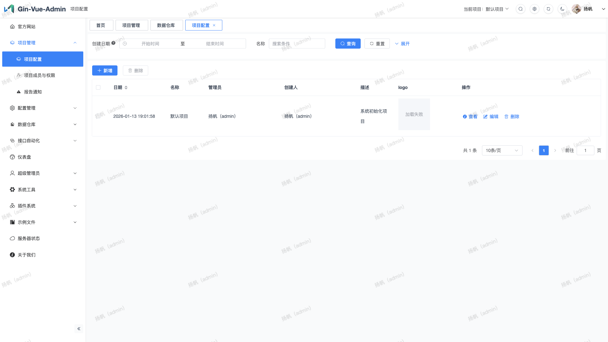

### 项目成员与权限
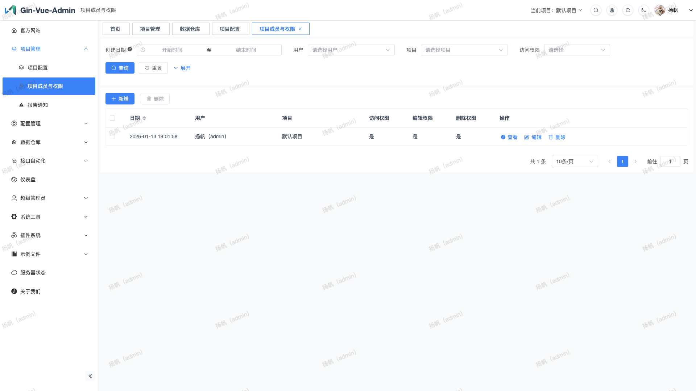

### 报告通知
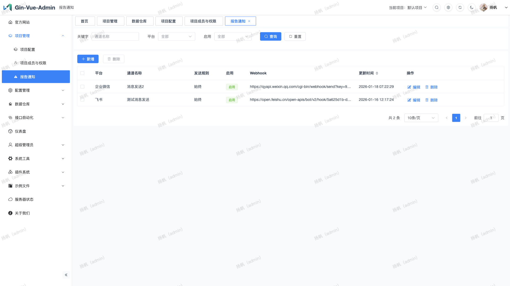

## 平台配置

### 环境变量管理
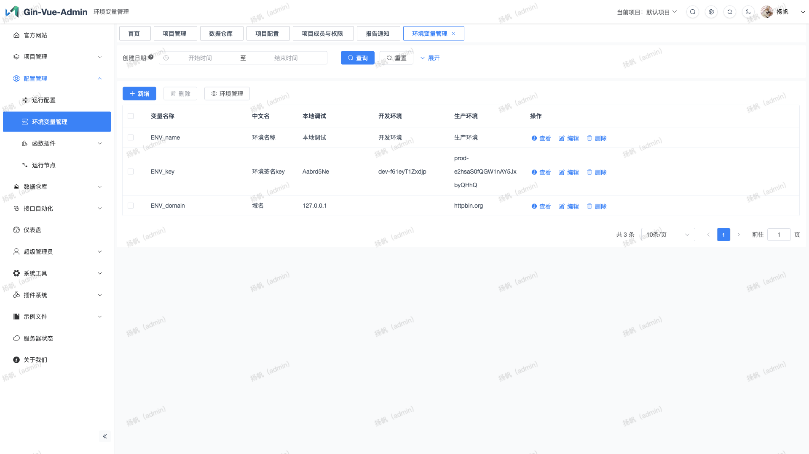

### 运行配置
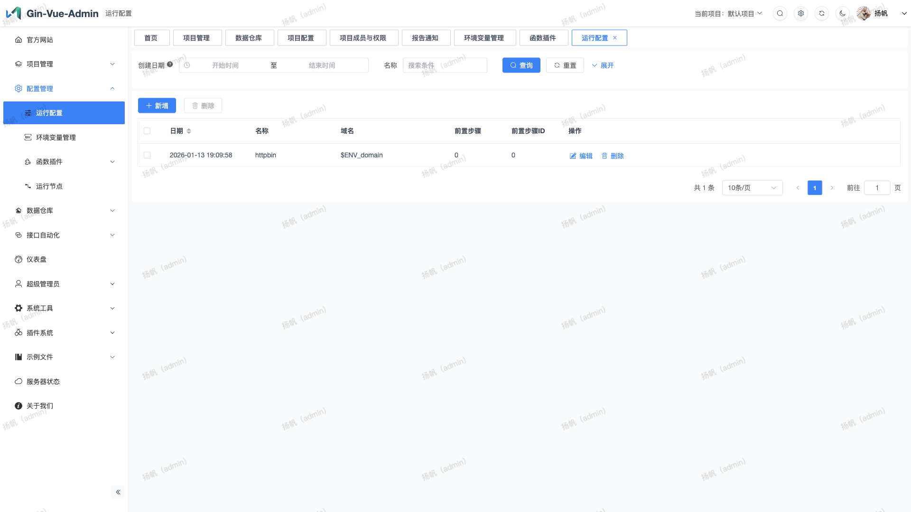

### 运行节点
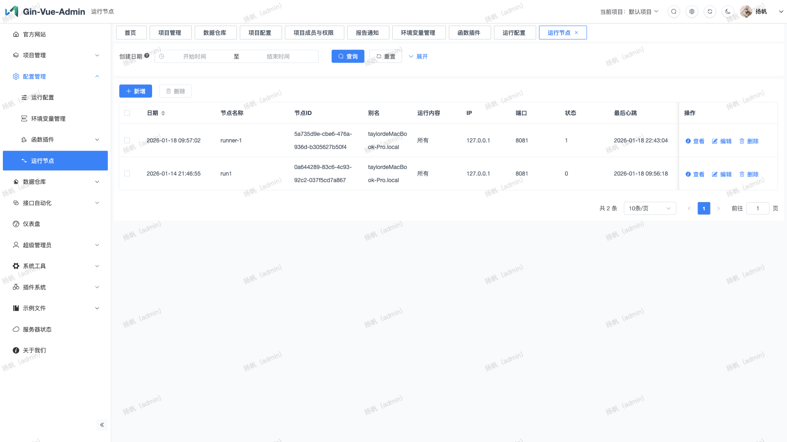

#### Python 函数
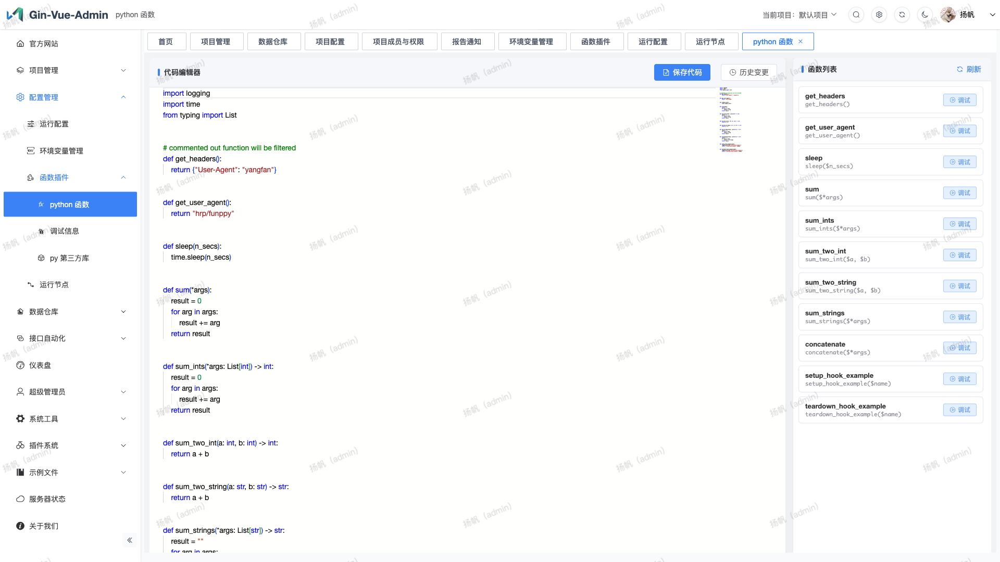

#### 调试信息
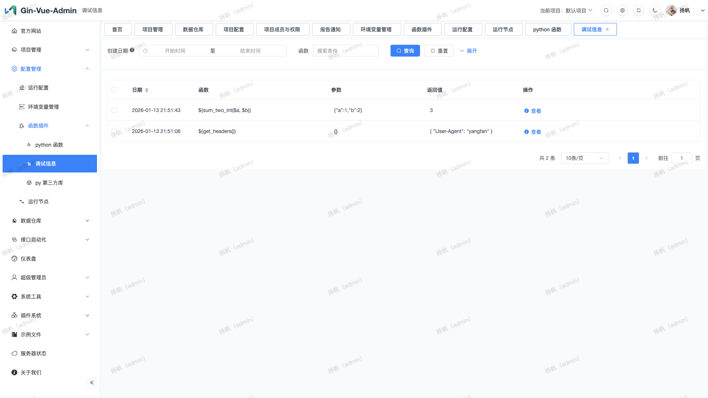

#### Py 第三方库
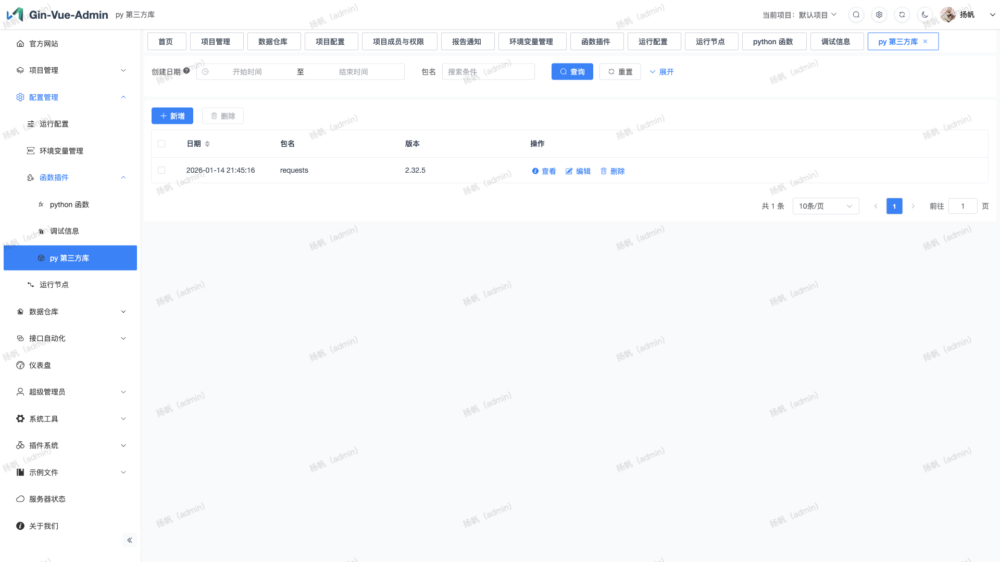

## 接口自动化

### 接口管理
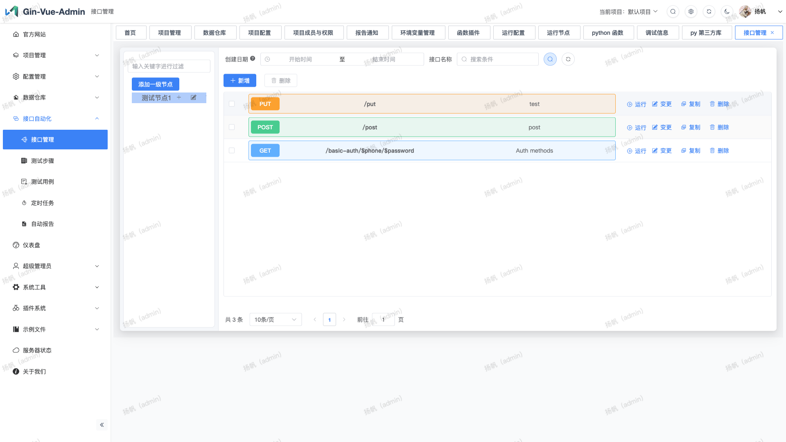

### 测试步骤
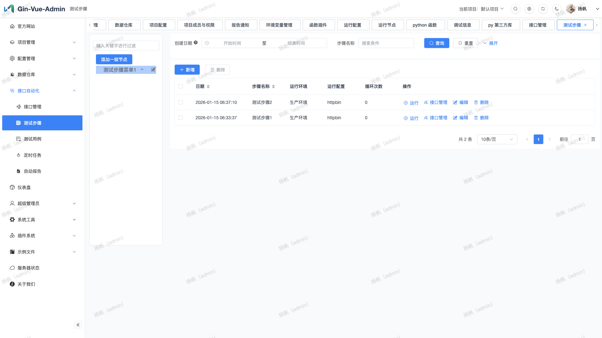

### 测试用例
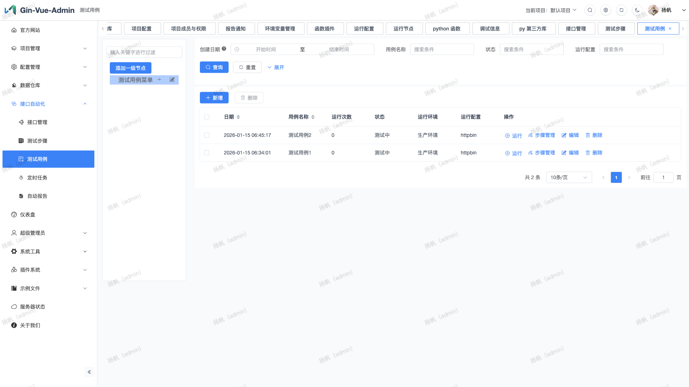

### 定时任务

### 自动报告
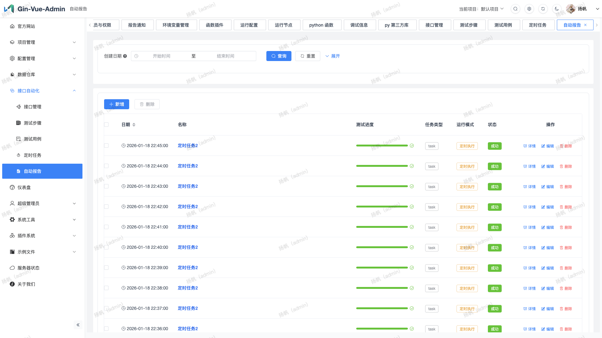

## 数据仓库

### 数据分类
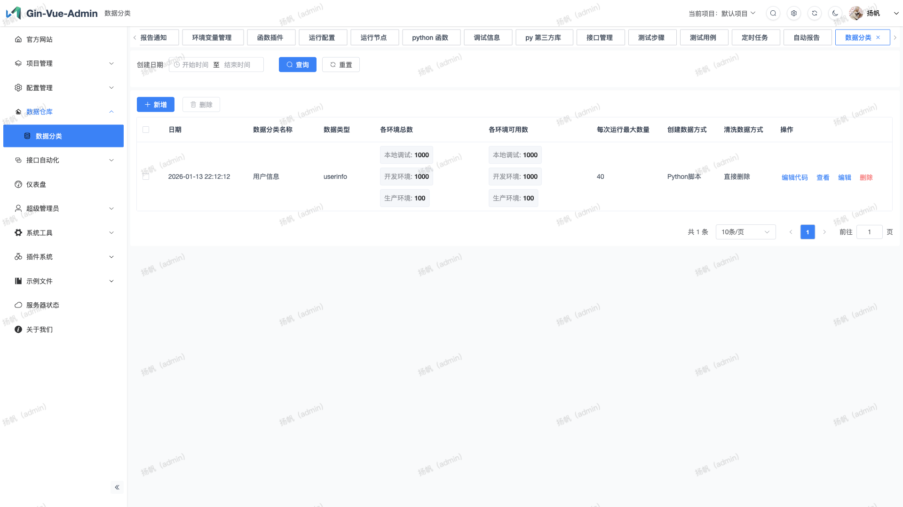

