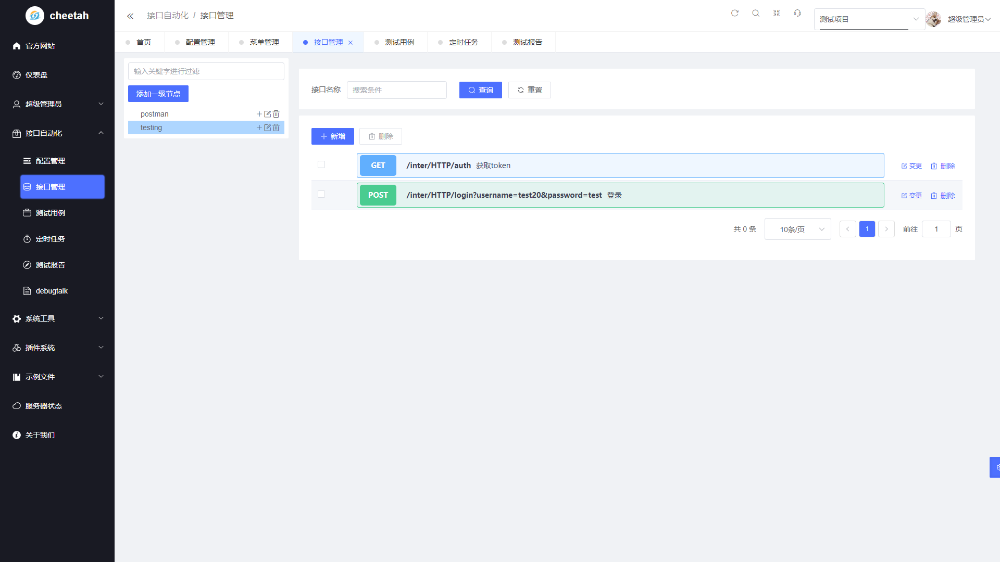
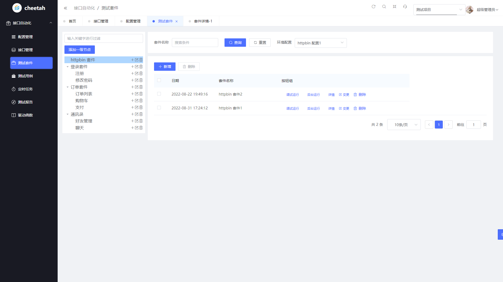
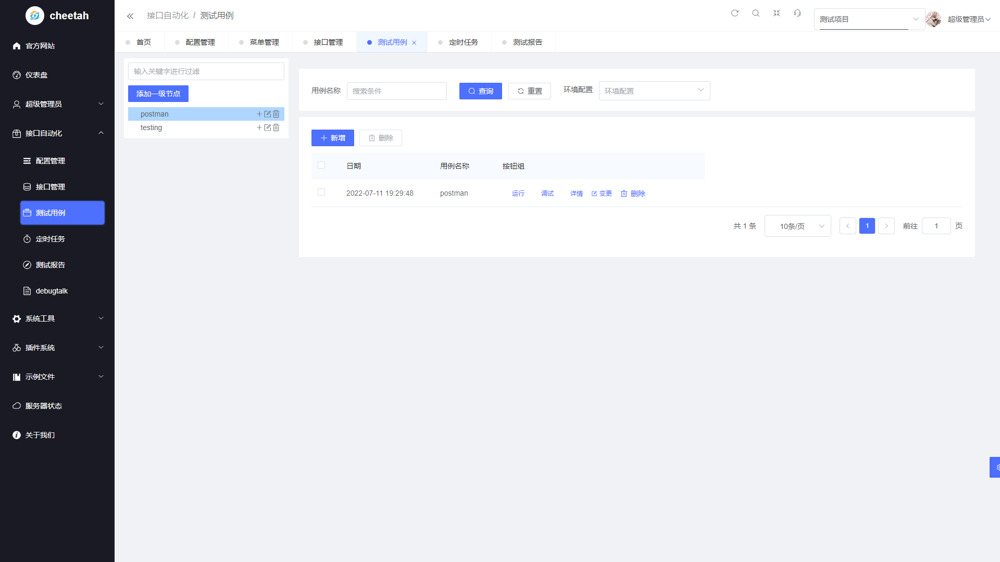
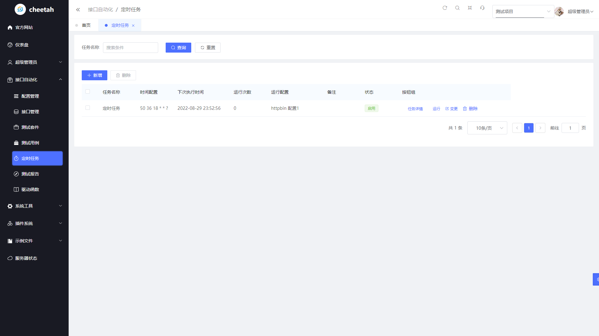
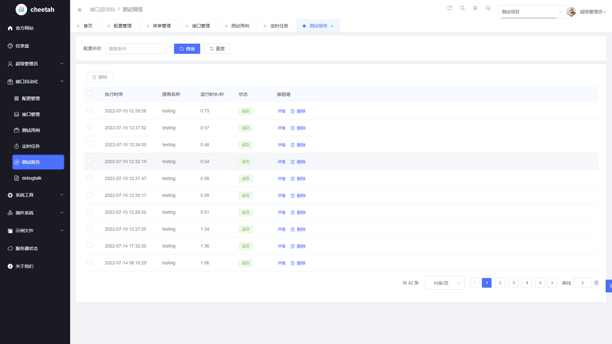
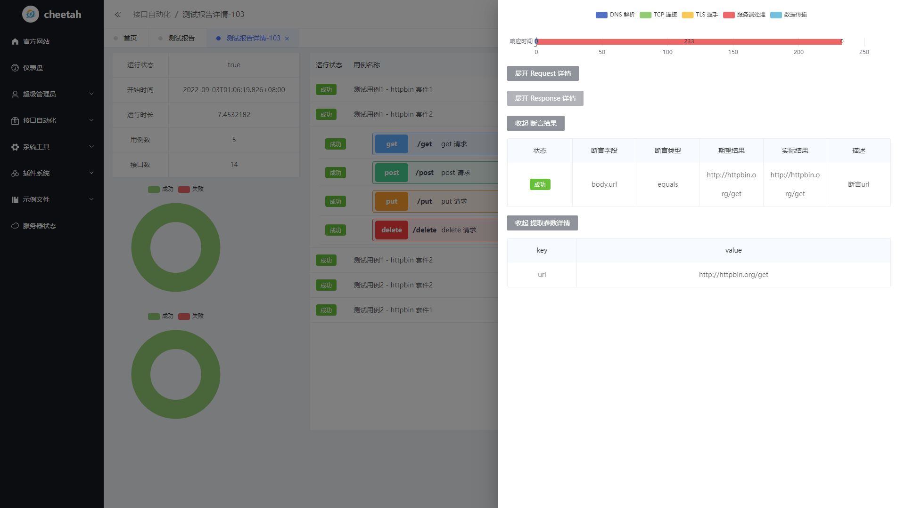

# Cheetah


- 前后端采用[gin-vue-admin v2.5.3](https://www.gin-vue-admin.com/), Gin + Vue全栈开发基础平台
- 测试引擎采用[HttpRunner V4](https://httprunner.com/),支持 HTTP(S)/HTTP2/WebSocket/RPC 等网络协议，涵盖接口测试、性能测试、数字体验监测等测试类型。简单易用，功能强大，具有丰富的插件化机制和高度的可扩展能力。
- [测试平台接入HttpRunner V4](https://www.yuque.com/docs/share/bb392180-8ea9-46a0-a27b-bb4fbec3450e?#)
## 支持功能
- [x] 用户管理
- [x] 项目管理
- [x] 接口管理
- [x] 测试用例管理
- [x] 定时任务
- [x] 生成测试报告
- [x] 并发执行多个定时任务/用例/接口
- [x] 用例之间的数据传递：请求头和参数导出
- [x] 网络性能采集：在场景化接口测试的基础上，可额外采集网络链路性能指标（DNS 解析、TCP 连接、SSL 握手、网络传输等）
- [x] 数据驱动`parameterize`
- [x] python 函数驱动
- [x] 通过标签运行定时任务(可用户发版时做全量回归)
- [x] 定时任务并发执行，定时任务可以根据用户设置并发数，节省等待时间
- [x] 通过标签运行定时任务(可用户发版时做全量回归)
- [x] 定时任务并发执行，定时任务可以根据用户设置并发数，节省等待时间
- [ ] 支持sql操作
- [ ] 可视化数据报表
- [ ] 数据驱动`parameterize`,页面操作
- [ ] go 函数驱动
- [ ] 支持更多协议，`HTTP/2`、`WebSocket`、`TCP`、`RPC`等
- [ ] 支持用例导入，`json`、`postman`、`swagger`等
- [x] 性能测试
- [ ] web UI 自动化测试

# 在线demo

首页：http://82.157.150.119:8080/
用户名：admin
密码： 123456

# 部署方式


> - [环境准备](https://www.gin-vue-admin.com/guide/start-quickly/env.html)
> - 1、新建数据库，并导入docs/sql/yangfan.sql文件
> - 2、修改`server/config.yaml`文件中的数据库`mysql`、飞书登录`fs`相关配置
> - 3、修改`web/.env.development`、 `web/.env.production`中的`VITE_FS_LOGIN`、`VITE_FS_APP_ID`

### [本地调试](https://www.gin-vue-admin.com/guide/start-quickly/initialization.html)

## 项目上线

### 前端
> 在web目录下执行 npm run build 得到 dist文件夹 将dist文件夹上传到服务器 建议使用nginx进行代理 并且设置 proxy 把请求代理到后端

### 后端
首次安装运行，由于httprunner在Linux上环境缺少pip，所以需要执行2-4步骤，非首次安装只需要执行步骤1即可

> 1. 执行脚本`cheeath.sh`，config为根目录下的`config.production.yaml`
> 2. 进入接口管理并在任意功能模块（接口管理、测试套件、测试用例、定时任务）运行1次
> 3. cd `./docs`，执行`/root/.hrp/venv/bin/python3 get-pip.py`
> 4. 重启服务

### nginx 配置
```nginx
server {
    listen  8080;
    server_name localhost;

    #charset koi8-r;
    #access_log  logs/host.access.log  main;

    location / {
        root /usr/share/nginx/html/dist;
        add_header Cache-Control 'no-store, no-cache, must-revalidate, proxy-revalidate, max-age=0';
        try_files $uri $uri/ /index.html;
    }

    location /api {
        proxy_set_header Host $http_host;
        proxy_set_header  X-Real-IP $remote_addr;
        proxy_set_header X-Forwarded-For $proxy_add_x_forwarded_for;
        proxy_set_header X-Forwarded-Proto $scheme;
        rewrite ^/api/(.*)$ /$1 break;  #重写
        proxy_pass http://127.0.0.1:8888; # 设置代理服务器的协议和地址
     }
    location  /form-generator {
        proxy_set_header Host $http_host;
        proxy_set_header X-Real-IP $remote_addr;
        proxy_set_header X-Forwarded-For $proxy_add_x_forwarded_for;
        proxy_set_header X-Forwarded-Proto $scheme;
        proxy_pass http://127.0.0.1:8888;
    }
    location /api/swagger/index.html {
        proxy_pass http://127.0.0.1:8888/swagger/index.html;
     }
 }

```

# 项目概况








