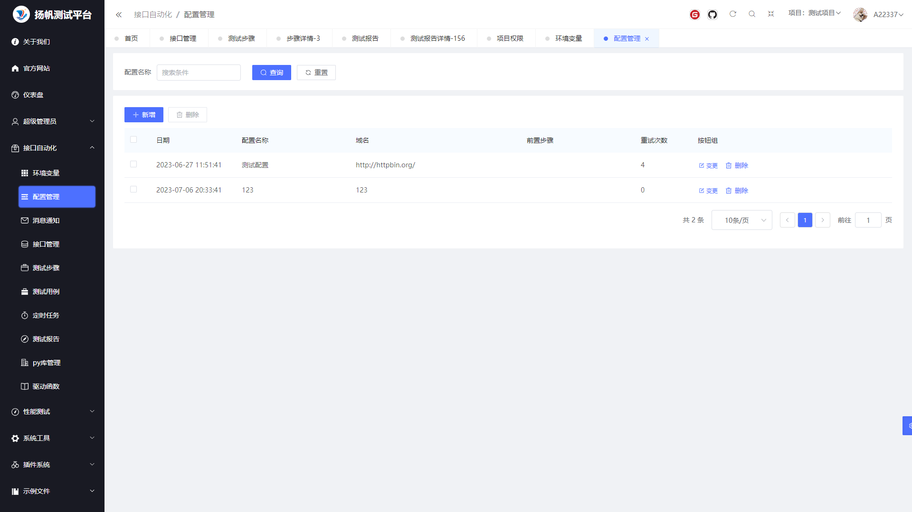
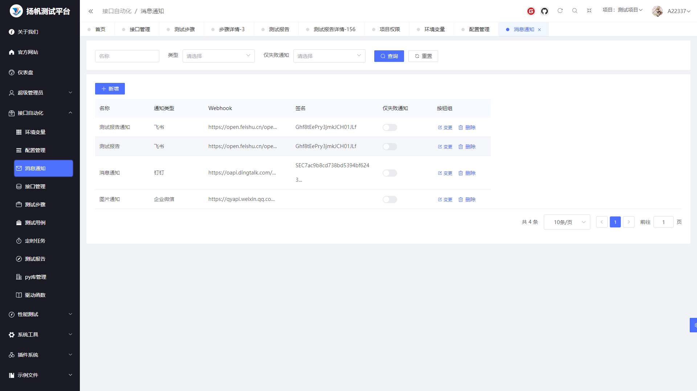
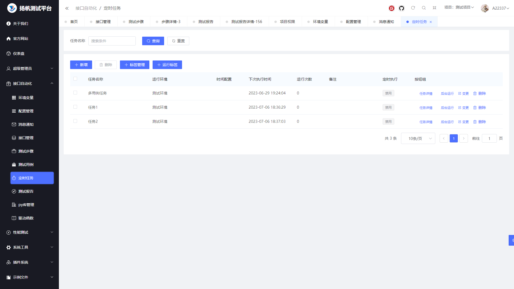
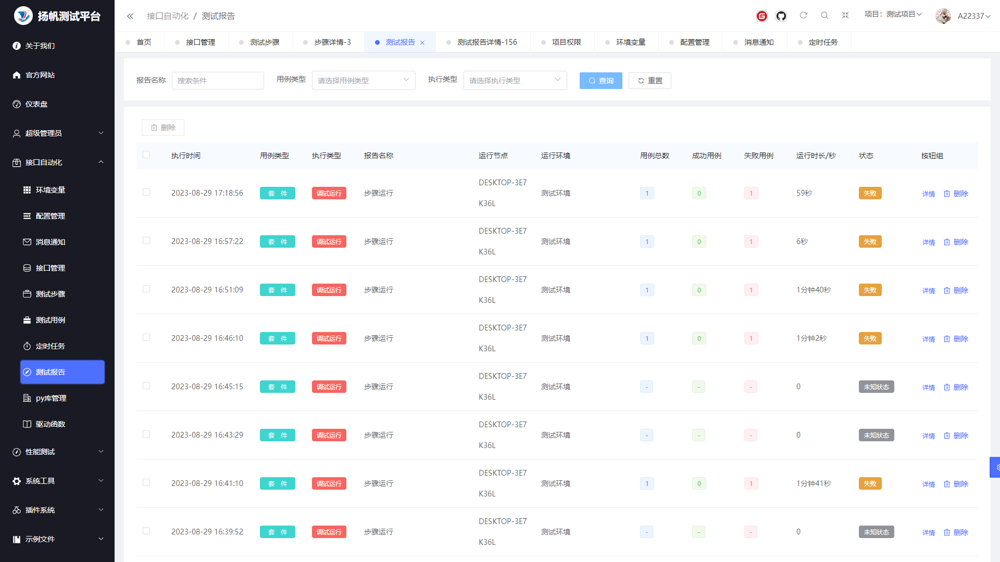
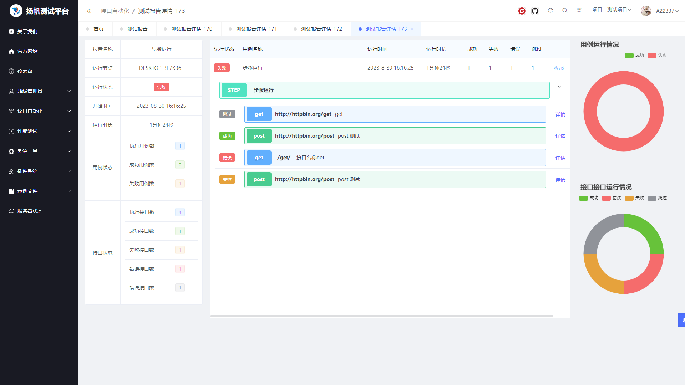
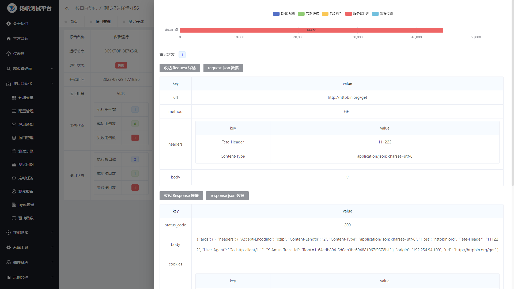
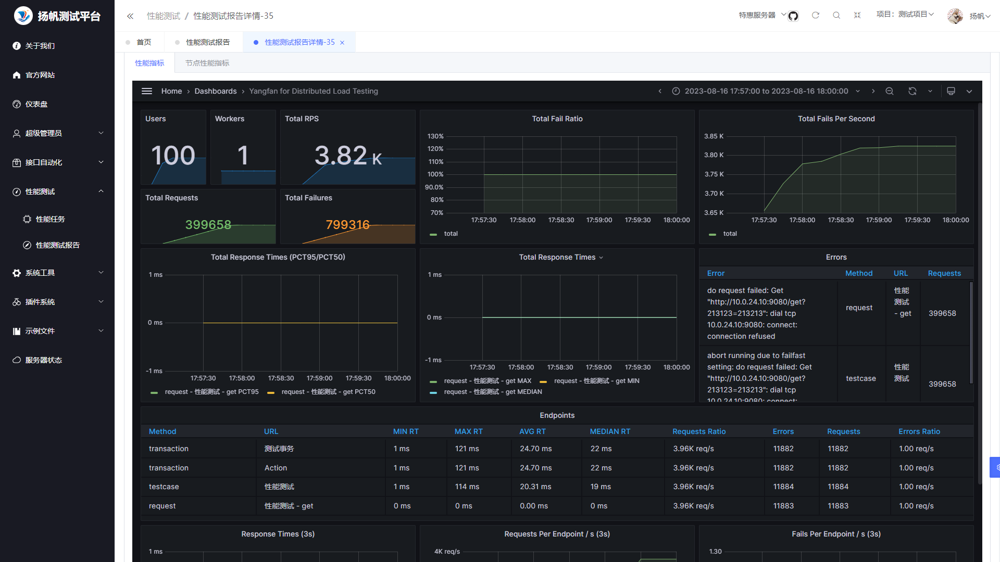

# 扬帆测试平台

- 前后端采用[gin-vue-admin v2.5.3](https://www.gin-vue-admin.com/), Gin + Vue全栈开发基础平台
- 测试引擎采用[HttpRunner V4](https://httprunner.com/),支持 HTTP(S)/HTTP2/WebSocket/RPC 等网络协议，涵盖接口测试、性能测试、数字体验监测等测试类型。简单易用，功能强大，具有丰富的插件化机制和高度的可扩展能力。
- [测试平台接入HttpRunner V4](https://www.yuque.com/docs/share/bb392180-8ea9-46a0-a27b-bb4fbec3450e?#)
# 支持功能
- [x] 用户管理
- [x] 项目管理，用户在项目的权限、CI密钥设置
- [x] 环境管理
- [x] 接口管理
- [x] 测试用例管理
- [x] 用例之间的数据传递：请求头和参数导出
- [x] 定时任务
- [x] 通过标签运行定时任务(可用户发版时做全量回归)
- [x] 定时任务并发执行，定时任务可以根据用户设置并发数，节省等待时间
- [x] 生成测试报告
- [x] 网络性能采集：在场景化接口测试的基础上，可额外采集网络链路性能指标（DNS 解析、TCP 连接、SSL 握手、网络传输等）
- [x] python 函数驱动
- [X] 安装python第三方库，服务器第一次启动时默认安装所有第三方库
- [x] 已支持协议：`HTTP/2`、`Grpc`
- [x] 支持用例导入，`json`、`postman`、`swagger`等
- [x] 性能测试，支持多机负载测试，通过k8s部署可以实现动态扩缩容
- [x] 多种部署方式，docker构建和远程镜像库、一键部署脚本、k8s部署
- [x] 测试报告通知，目前支持飞书、钉钉和企业微信的消息通知
- [x] CI执行
- [ ] 支持sql操作
- [ ] 可视化数据报表
- [ ] 数据驱动`parameterize`,页面操作
- [ ] go 函数驱动
- [ ] 支持更多协议，`WebSocket`、`TCP`、`RPC`等
- [ ] web UI 自动化测试

# 在线demo

首页：http://82.157.150.119:8080/
用户名：admin
密码： 123456

# 项目部署

[本地调试、docker部署、k8s部署](./deploy/README.md)

# 项目概况

登录页面

环境变量

配置管理

消息通知

接口管理

测试步骤

定时任务

测试报告

测试报告详情

测试报告详情

性能测试报告

