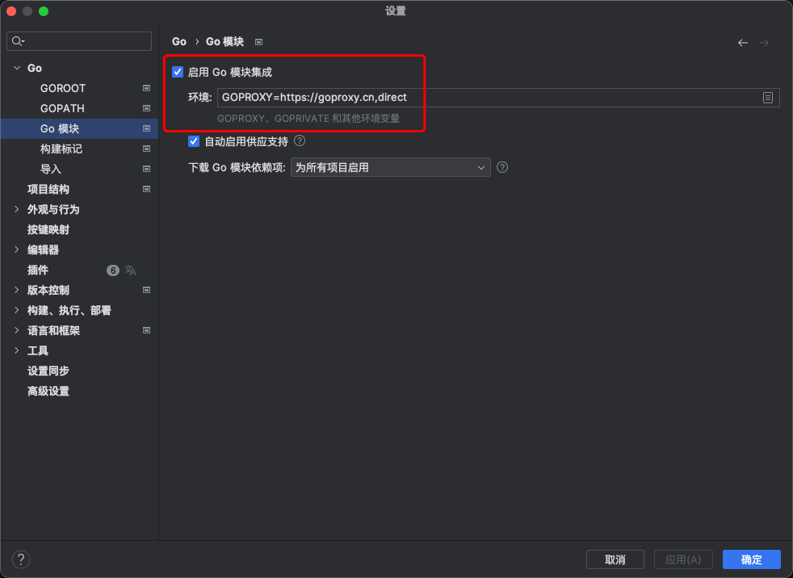

我们在源码解析中，已经对hrp最主要的内容进行讲解，如果有那部分不清楚或者想更深入的了解某方面功能的源码，可以联系作者

对于go语言，大多数测试从业者相对比较陌生，对于安装第三方库、编译和交叉编译了解起来成本比较大，本次文章将为大家讲解如何进行编译，后续文章讲解一些简单的修改，如：跳过逻辑、header状态保持、hooks修改请求和返回内容、使用mock、增加断言类型、性能测试日志过滤等内容，有需要二次开发内容也可以联系作者

## 修改版本号
版本号可以不用修改，但为了更好的原版本号区分，建议修改版本号，并增加前缀或者后缀进行区分，如：yangfan.v4.4.0、v4.4.0.yangfan
存放路径为：“/httprunner/hrp/internal/version/VERSION”，版本号为字符串格式

## 更新依赖
```shell
# 先把fork项目然后执行命令
git clone git@github.com:taylor9158/httprunner.git
```
### 命令行更新
```shell
cd httprunner
# 此步骤可以跳过，一般情况下都会出现timeout的错误
go mod tidy
```
#### 错误处理
PS: 更新依赖库时，会出现可能会因为网络问题而出现timeout的错误，可以通过设置代码模块解决
```shell
go env -w GOPROXY=https://goproxy.cn,direct
go mod tidy
```

### 使用IDE(Goland)进行更新
1. 打开httprunner目录
2. 在终端中执行命令
```shell
# 此步骤可以跳过，一般情况下都会出现timeout的错误
go mod tidy
```
#### 错误处理
PS: 更新依赖库时，会出现可能会因为网络问题而出现timeout的错误，可以通过设置代码模块解决
1. 打开「设置 - Go - go 模块」
2. 在「go 模块」中启用「启用 Go 模块集成」，并在输入框中填入「GOPROXY=https://goproxy.cn,direct」
    
3. 重新执行「go mod tidy」（次步骤可以）
4. 如果设置后执行还是有问题，重启Goland后重新执行「go mod tidy」

## 编译
完成依赖安装后就可以直接执行脚本进行编译，脚本路径「scripts/build.sh」,可以通过执行make或bash进行编译。
PS：增加tags后执行无法编译，暂时不知道错误在哪里
```shell
# Usage:
# $ make build
# $ make build tags=opencv
# or
# $ bash scripts/build.sh
# $ bash scripts/build.sh opencv
```
这是构建当前系统下用的文件，如果你想构建其他系统的可执行文件，就要用到交叉编译
### 交叉编译
1. 交叉编译使用的变量
   * GOOS：GOOS 变量用于指定目标操作系统。你可以将其设置为目标操作系统的值，如 "windows"、"linux"、"darwin"（macOS）、"freebsd" 等。
   * GOARCH：GOARCH 变量用于指定目标架构。你可以将其设置为目标架构的值，如 "amd64"、"386"、"arm" 等。
   * CGO_ENABLED：在交叉编译时，建议将设置为 0，以确保生成的二进制文件不依赖于系统的C库，这有助于确保生成的二进制文件可以在不同平台上正确运行。
2. 以编译linux为例，执行构建命令
    ```shell
    CGO_ENABLED=0 GOOS=linux GOARCH=amd64 bash scripts/build.sh
    ```
## 编译windows可执行文件出现错误
1. 用命令***CGO_ENABLED=0 GOOS=windows GOARCH=amd64 bash scripts/build.sh***无法正常输出后缀为exe的文件
2. `build.sh` 文件中使用编译的命令为***go build -ldflags '-s -w' -o "output/hrp" hrp/cmd/cli/main.go***
3. 由于输出的统一目录为`output/hrp`,所以生成的文件无法执行，下面是正确的执行：
```shell
CGO_ENABLED=0 GOOS=windows GOARCH=amd64 go build -ldflags '-s -w' -o "output/hrp.exe" hrp/cmd/cli/main.go
```