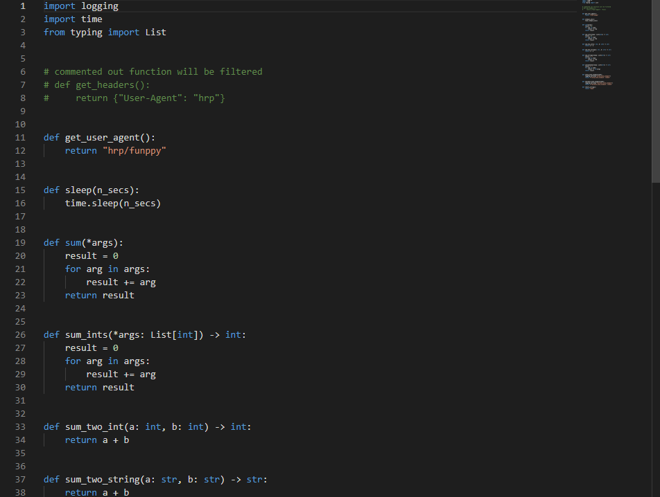

# 测试平台函数驱动
> 使用`Monaco Editor`实现的简易代码编辑器
### 先来个效果图




## 代码

> 关于自动补全，默认下的`keywords`只要140多个，对自动补全不是很友好
> 实现自定义关键字来补全，可以添加自己常用的库，只需要修改`keywords`字段就可以实现
> 在`python`代码中的`lib`加上自己常用的库，修改`javascript`中`keywords`为`python`的数据结果即可

```python
from importlib import import_module


def is_public(name):
    return not (name.startswith('__') and name.endswith('__'))


def get_functions(source):
    return [name for name in dir(source) if callable(getattr(source, name)) and is_public(name)]


lib = ['requests', 'math', 'datetime', 'string', 're', 'os', 'io', 'time']
func = ['False', 'None', 'True', 'and', 'as', 'assert', 'async', 'await', 'break', 'class', 'continue', 'def', 'del',
        'elif', 'else', 'except', 'exec', 'finally', 'for', 'from', 'global', 'if', 'import', 'in', 'is', 'lambda',
        'nonlocal', 'not', 'or', 'pass', 'print', 'raise', 'return', 'try', 'while', 'with', 'yield', 'int', 'float',
        'long', 'complex', 'hex', 'abs', 'all', 'any', 'apply', 'basestring', 'bin', 'bool', 'buffer', 'bytearray',
        'callable', 'chr', 'classmethod', 'cmp', 'coerce', 'compile', 'complex', 'delattr', 'dict', 'dir', 'divmod',
        'enumerate', 'eval', 'execfile', 'file', 'filter', 'format', 'frozenset', 'getattr', 'globals', 'hasattr',
        'hash', 'help', 'id', 'input', 'intern', 'isinstance', 'issubclass', 'iter', 'len', 'locals', 'list', 'map',
        'max', 'memoryview', 'min', 'next', 'object', 'oct', 'open', 'ord', 'pow', 'print', 'property', 'reversed',
        'range', 'raw_input', 'reduce', 'reload', 'repr', 'reversed', 'round', 'self', 'set', 'setattr', 'slice',
        'sorted', 'staticmethod', 'str', 'sum', 'super', 'tuple', 'type', 'unichr', 'unicode', 'vars', 'xrange', 'zip',
        '__dict__', '__methods__', '__members__', '__class__', '__bases__', '__name__', '__mro__', '__subclasses__',
        '__init__', '__import__']
for j in lib:
    func.extend(get_functions(import_module(j)))
print(list(set(func)))
``` 


```vue
<template>
  <div style="margin-bottom: 20px">
    <el-button type="primary"  @click="handleCode" round>
      点击保存
    </el-button>
  </div>
  <div class="wrapper">
    <el-row type="flex" >
      <el-col :span="14">
        <el-form :inline="true">
        </el-form>
        <div id="codeEditBox"></div>
      </el-col>

    </el-row>
  </div>

</template>

<script>
export default {
  name: "MonacoEditor"
}
</script>

<script setup>
import * as monaco from 'monaco-editor'
import { ref, toRaw } from 'vue'
import $ from 'jquery'
import {getDebugTalk, updateDebugTalk} from "@/api/interfaceTemplate";
import {ElMessage} from "element-plus";
import { language as pythonLanguage } from '@/view/interface/debugtalk/debugtalk/python.js';
const editor = ref(null)
const editorTheme = ref("vs-dark")
const language = ref("python")
const content = ref("")

const props = defineProps({
  debugTalkType: ref(),
})


const initEditor = () => {

  // 初始化编辑器，确保dom已经渲染
  editor.value = monaco.editor.create(document.getElementById('codeEditBox'), {
    value: content.value, //编辑器初始显示文字
    language: language.value, //语言支持自行查阅demo
    theme: editorTheme.value, //官方自带三种主题vs, hc-black, or vs-dark
    selectOnLineNumbers: true,//显示行号
    roundedSelection: false,
    readOnly: false, // 只读
    cursorStyle: 'line', //光标样式
    automaticLayout: true, //自动布局
    glyphMargin: false, //字形边缘
    useTabStops: false,
    fontSize: 14, //字体大小
    autoIndent: true, //自动布局
    quickSuggestionsDelay: 100, //代码提示延时
  });
  // 监听值的变化
  // editor.value.onDidChangeModelContent((val) => {
  //   console.log("--------------",val.changes[0].text)
  // })

  // 创建代码提醒
  const pythonCompletion = monaco.languages.registerCompletionItemProvider('python', {
    provideCompletionItems: function () {
      let suggestions = [];
      pythonLanguage.keywords.forEach(item => {
        suggestions.push({
          label: item,
          kind: monaco.languages.CompletionItemKind.Keyword,
          insertText: item
        });
      })
      return {
        suggestions:suggestions
      };
    },
  });
}


const handleCode = async () => {
  // console.log("==========", toRaw(editor.value).getValue())
  let updateData = {file_type: props.debugTalkType, content: toRaw(editor.value).getValue()}
  const res = await updateDebugTalk(updateData)
  if (res.code === 0) {
    ElMessage({
      type: 'success',
      message: '更新成功'
    })

  }
}

const init = async () => {
  let data = {file_type:props.debugTalkType}
  const res = await getDebugTalk(data)
  if (res.code === 0) {
    content.value = res.data.reapicase.content
    $(document).ready(function () {
      initEditor()
    })
  }
}

init()

</script>

<style scoped>
.wrapper {
  margin: 20px auto;
}
#codeEditBox {
  font-family: Avenir, Helvetica, Arial, sans-serif;
  height: 720px;
  width: 170%;
  padding: 0;
  overflow: hidden;
  margin-bottom: 15px;
}
</style>
```
```javascript
/*---------------------------------------------------------------------------------------------
 *  Copyright (c) Microsoft Corporation. All rights reserved.
 *  Licensed under the MIT License. See License.txt in the project root for license information.
 *--------------------------------------------------------------------------------------------*/
// monaco-editor/esm/vs/basic-languages/python/python.js
import { languages } from 'monaco-editor/esm/vs/basic-languages/fillers/monaco-editor-core.js';
export var conf = {
    comments: {
        lineComment: '#',
        blockComment: ["'''", "'''"]
    },
    brackets: [
        ['{', '}'],
        ['[', ']'],
        ['(', ')']
    ],
    autoClosingPairs: [
        { open: '{', close: '}' },
        { open: '[', close: ']' },
        { open: '(', close: ')' },
        { open: '"', close: '"', notIn: ['string'] },
        { open: "'", close: "'", notIn: ['string', 'comment'] }
    ],
    surroundingPairs: [
        { open: '{', close: '}' },
        { open: '[', close: ']' },
        { open: '(', close: ')' },
        { open: '"', close: '"' },
        { open: "'", close: "'" }
    ],
    onEnterRules: [
        {
            beforeText: new RegExp('^\\s*(?:def|class|for|if|elif|else|while|try|with|finally|except|async).*?:\\s*$'),
            action: { indentAction: languages.IndentAction.Indent }
        }
    ],
    folding: {
        offSide: true,
        markers: {
            start: new RegExp('^\\s*#region\\b'),
            end: new RegExp('^\\s*#endregion\\b')
        }
    }
};
export var language = {
    defaultToken: '',
    tokenPostfix: '.python',
    keywords: [
        "exec",
        "frexp",
        "gamma"
    ],
    brackets: [
        { open: '{', close: '}', token: 'delimiter.curly' },
        { open: '[', close: ']', token: 'delimiter.bracket' },
        { open: '(', close: ')', token: 'delimiter.parenthesis' }
    ],
    tokenizer: {
        root: [
            { include: '@whitespace' },
            { include: '@numbers' },
            { include: '@strings' },
            [/[,:;]/, 'delimiter'],
            [/[{}\[\]()]/, '@brackets'],
            [/@[a-zA-Z_]\w*/, 'tag'],
            [
                /[a-zA-Z_]\w*/,
                {
                    cases: {
                        '@keywords': 'keyword',
                        '@default': 'identifier'
                    }
                }
            ]
        ],
        // Deal with white space, including single and multi-line comments
        whitespace: [
            [/\s+/, 'white'],
            [/(^#.*$)/, 'comment'],
            [/'''/, 'string', '@endDocString'],
            [/"""/, 'string', '@endDblDocString']
        ],
        endDocString: [
            [/[^']+/, 'string'],
            [/\\'/, 'string'],
            [/'''/, 'string', '@popall'],
            [/'/, 'string']
        ],
        endDblDocString: [
            [/[^"]+/, 'string'],
            [/\\"/, 'string'],
            [/"""/, 'string', '@popall'],
            [/"/, 'string']
        ],
        // Recognize hex, negatives, decimals, imaginaries, longs, and scientific notation
        numbers: [
            [/-?0x([abcdef]|[ABCDEF]|\d)+[lL]?/, 'number.hex'],
            [/-?(\d*\.)?\d+([eE][+\-]?\d+)?[jJ]?[lL]?/, 'number']
        ],
        // Recognize strings, including those broken across lines with \ (but not without)
        strings: [
            [/'$/, 'string.escape', '@popall'],
            [/'/, 'string.escape', '@stringBody'],
            [/"$/, 'string.escape', '@popall'],
            [/"/, 'string.escape', '@dblStringBody']
        ],
        stringBody: [
            [/[^\\']+$/, 'string', '@popall'],
            [/[^\\']+/, 'string'],
            [/\\./, 'string'],
            [/'/, 'string.escape', '@popall'],
            [/\\$/, 'string']
        ],
        dblStringBody: [
            [/[^\\"]+$/, 'string', '@popall'],
            [/[^\\"]+/, 'string'],
            [/\\./, 'string'],
            [/"/, 'string.escape', '@popall'],
            [/\\$/, 'string']
        ]
    }
};

```
