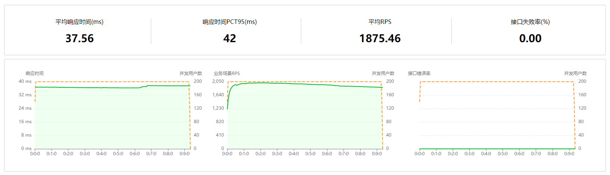
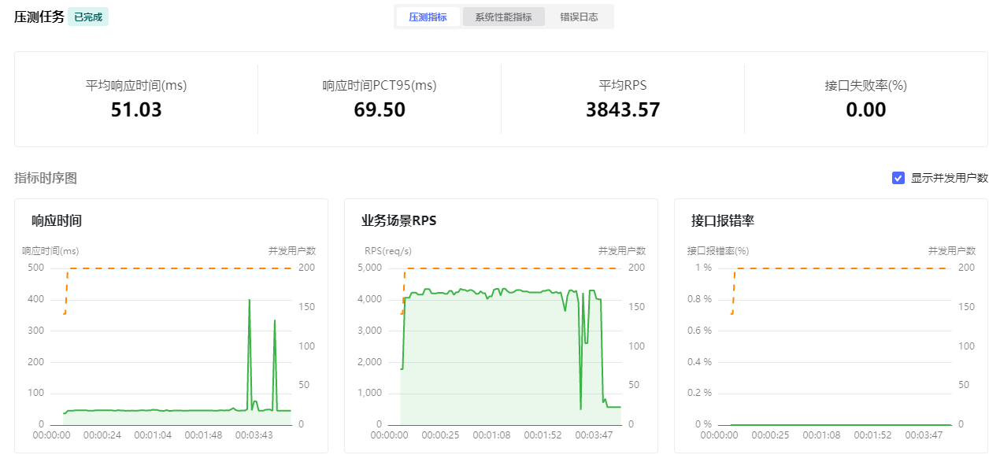
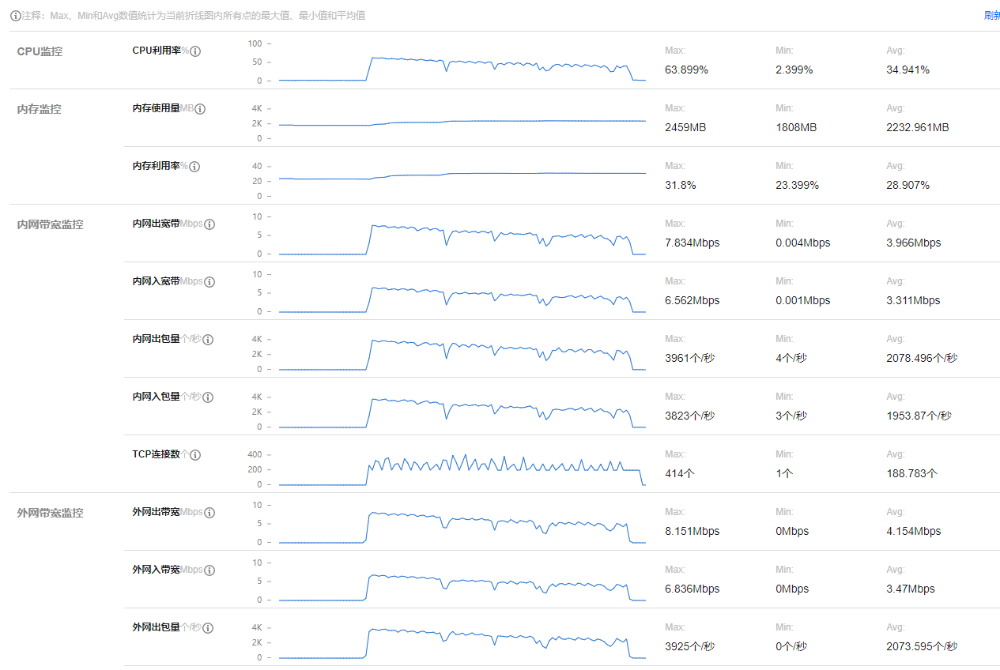
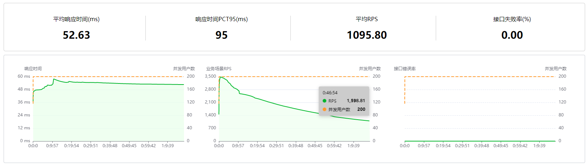
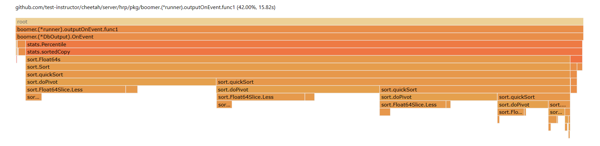
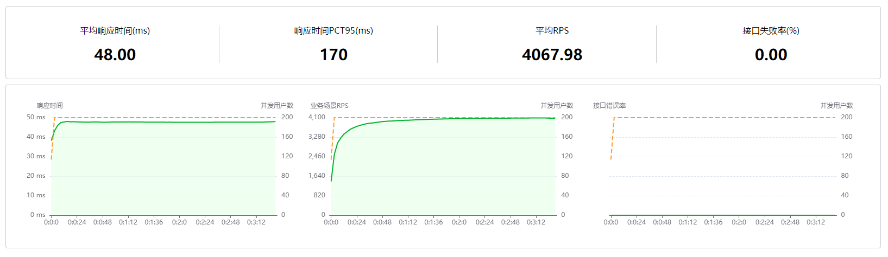
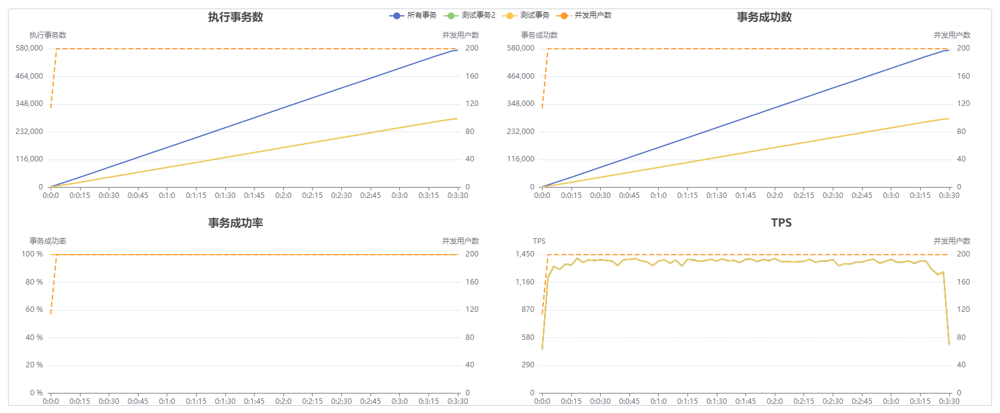

# 测试平台踩坑记录

## 错误信息
```shell
do request failed: Get "http://43.138.118.180:8080/hello/yangfan": dial tcp 43.138.118.180:8080: connectex: Only one usage of each socket address (protocol/network address/port) is normally permitted.
```


## 发现问题

1. 在修复plugin的问题后，觉得稳了，直接200个用户，前面几秒钟很正常，觉得真的可以了，可是好景不长，眨眼的功夫就开始有报错，报错率从1%快速增长到50%
2. 一般报错，就先降低一下并发数，改成100，还是不行，那么50总可以了吧，然而我还是太天真了，紧接着直接降到10，发现好像还是可以的

## 服务端问题排查

1. 压测服务是用docker部署的，4C8G10G的配置，理论上不应该就这么一点并发量，从控制台上看cpu、内存、网络都正常，有点怀疑是服务端只有一个节点的问题
2. 用minikube部署多节点试一下，如果是服务端问题，用10个节点，理论上可以到100的并发量，然而还是只能压到10个
3. 想着换个docker镜像，得出的结果也是一样，那么应该不是服务端的问题了
4. 这时候想到QuickRunner也是用httprunner，那么是不是也会有同样的问题呢，结果再次打脸，200个并发妥妥的，平均RPS将近4000，把服务器都给压挂了，这里不得不给httprunner点个赞


## 客户端问题排查

1. 排除了服务端问题，那么就是客户端了，而且在排查服务端的同时也验证了httprunner是正常的
2. 有问题一定就是我代码的问题了，胡乱查了一通，对yangfan和性能相关的代码过了一遍，没发现什么有价值的信息
3. 这时候想到报错信息，感觉可能是tpc连接问题，本地tcp连接池不够是否会引起这个报错，在出现大量报错的时候用`netstat -n | find "WAIT" /c`命令查看，发现有***1600***连接数而且一直保持了
4. QuickRunner 应该不会有这个问题，偷偷查了一下，发现只有***1600***上下
5. 这时候留了个心眼，用httprunner最新代码试一下，发现也会有同样的问题，那么很可能就不是我的问题了
6. 虽然最新代码和我有同样的问题，但是感觉还是有点不对劲，毕竟有问题一般都是自己写的代码有问题，仔细回想一下，是不是我的代码有什么问题
7. 继续排查我的代码，我用的`boomer_test.go`的代码,并发用户数2，每秒增加1个用户，运行5秒，那么肯定不会出现问题的，这只是测试的代码
    ```go
    b := NewStandaloneBoomer(2, 1)
	go b.Run(testcase1, &testcase2)
	time.Sleep(5 * time.Second)
	b.Quit()
    ```
8. 对比一下`hrp boom`的代码发现，发现少了`InitBoomer`的方法，很有可能就是这里的问题,最后发现`InitBoomer`内有关闭闲置连接的方法
   ```go
    // CloseIdleConnections closes any connections which were previously
    // connected from previous requests but are now sitting idle in
    // a "keep-alive" state. It does not interrupt any connections currently
    // in use.
    func (t *Transport) CloseIdleConnections() {
        t.nextProtoOnce.Do(t.onceSetNextProtoDefaults)
        t.idleMu.Lock()
        m := t.idleConn
        t.idleConn = nil
        t.closeIdle = true // close newly idle connections
        t.idleLRU = connLRU{}
        t.idleMu.Unlock()
        for _, conns := range m {
            for _, pconn := range conns {
                pconn.close(errCloseIdleConns)
            }
        }
        if t2 := t.h2transport; t2 != nil {
            t2.CloseIdleConnections()
        }
    }
   ```
9. 最后在代码里增加`InitBoomer`方法，实测结果正常

## 进行数据对比

> 脚本同样执行2个接口、1个事务，并发用户数200，每秒增加50个用户
### 压测数据
1. 测试平台压测数据
   > 
2. quickrunner 压测数据
   > 
### 压测数据分析

1. 响应时间差不多，quickrunner 响应时间大是因为服务器各项指标已经爆了，部分接口响应时间大影响到平均响应时间
2. 一样的并发数200，假设`平均响应时间`一样约50ms，但是平均`RPS`少了一半，服务器监控下CPU、带宽、每秒入包/出包数也是同样的`1:2`
3. RPS=并发数/平均响应时，很明显我的数据又有问题了
4. 接口数据都正常，压测时肯定是有部分操作影响到了结果，整理一下可能会有影响的操作
   * 数据库操作，理论上这应该是异步的，而且3秒一次
   * 日志打印

### 解决问题思路

1. 数据库操作
   * 理论上这应该是异步的，而且3秒一次应该不会有太大问题直
   * 接注释掉数据库操作，这样无法看到平台的数据，不过可以通过服务器来验证是否正常
   * 注释后没什么用，和预想的一样
2. 日志打印
   * 默认打印了所有的数据，可能是这里的问题，测试平台运行时CPU使用率已经在100%了，但是quickrunner使用率只有30%左右

### 解决日志打印问题
1. 取消日志打印，取消后开始压的时候有点效果，不过一段时间后，数据开始缓慢下降
2. 从服务器的日志分析，CPU、带宽、每秒入包/出包数一直在降低

3. 从测试平台分析，并发量一直减少，客户端(测试平台)CPU使用率正常，

4. 从CPU使用率得知`outputOnEvent`的使用率占比很高，

5. 分析`outputOnEvent`函数，整体占用率不高，那么导致这个问题应该是函数`outputOnEvent`没有用协程。查看源码，发现用了协程，但是也用了线程阻塞，在测试报告入库时用协程应该可以解决问题
   ```go
   package boomer
   func (r *runner) outputOnEvent(data map[string]interface{}) {
       size := len(r.outputs)
       if size == 0 {
           return
       }
       wg := sync.WaitGroup{}
       wg.Add(size)
       for _, output := range r.outputs {
           go func(o Output) {
               o.OnEvent(data)
               wg.Done()
           }(output)
       }
       wg.Wait()
   }
   ```

## 解决效果
数据接近`hrp boom`的压测数据， 最后定位到原因时计算PCT时，由于压测时间越长，请求数据多，导致计算时间长，而数据输出没有异步执行，所以影响了压测结果，入库操作采用队列方式
> 测试报告数据偶现丢失情况，已经提issues给作者了，有兴趣可以点击[查看详情](https://github.com/httprunner/httprunner/issues/1546)






