# 功能模块
> - 配置管理
> - 接口管理
> - 测试步骤
> - 测试用例
> - 定时任务
> - 测试报告
> - 驱动函数

# 使用介绍
## 树形菜单
在`接口管理`、`测试步骤`、`测试用例`中的菜单，主要用于分类管理

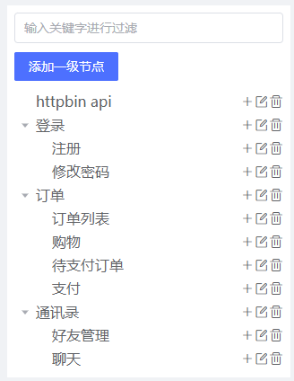

## 运行
> 1. 根据用例类型分为`api`、`步骤`、`用例`、`定时任务`
> 2. 根据运行类型分为`保存调试`、`调试运行`、`后台运行`、`定时运行`
> 3. `保存调试`、`调试运行`会在运行后跳转至测试报告详情页
> 4. `后台运行`、`定时运行`需要在测试报告中进行查看

## 配置管理
1. 默认配置：接口管理中调试使用的默认配置
2. 前置步骤：在`测试步骤`、`测试用例`、`定时任务`执行时有效，常用于登录鉴权操作

## 接口管理
1. Header: 请求头，复选框为将当前请求头字段导出为全局header，场景：token保持在后续的接口中，无需每个接口再添加token字段
2. Extract：提取变量，复选框为将当前请求头字段导出为全局变量，场景：用于步骤、用例的解耦，假设步骤执行顺序为步骤A、步骤B，那么可以在步骤B中引用步骤A导出的变量，`引用其他步骤的变量时需要确保执行顺序`
3. `Params`、`Form`、`Jsons`、`Validate`、`Variables`参考`httprunner`中的应用
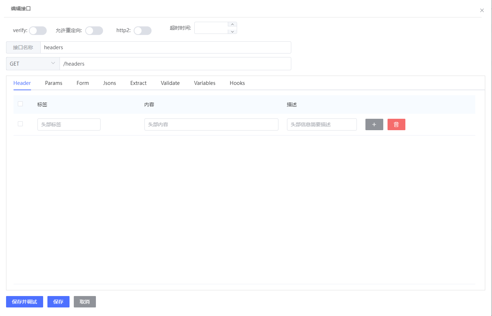

## 测试步骤
复用于接口管理中的api，无法直接在步骤中进行新建
### 步骤使用
1. 新建步骤
2. 进入步骤详情，在详情中添加api，对已添加的api进行拖动排序
3. 在步骤详情对测试接口进行定制化修改、删除、拖动排序

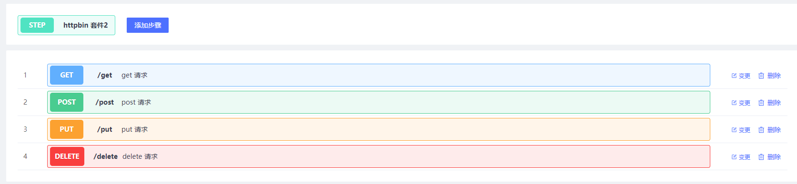
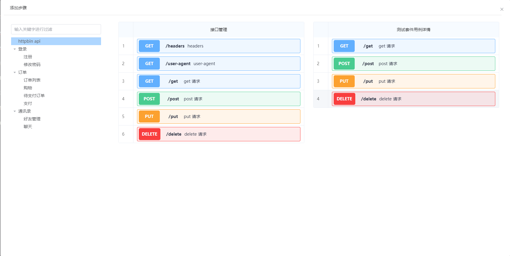

## 测试用例
> 各用例的数据应该独立，不能依赖于其他用例，如数据有依赖，需要在步骤中增加对应的依赖
1. 新建测试用例
2. 进入用例详情，在详情中添加步骤，一个用例可以同时添加多个步骤（一个步骤可以被多次添加）
3. 在用例详情中调整步骤执行顺序

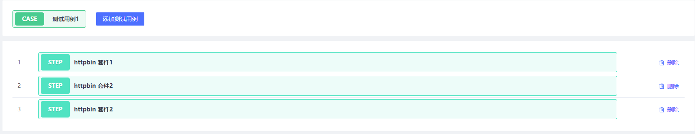
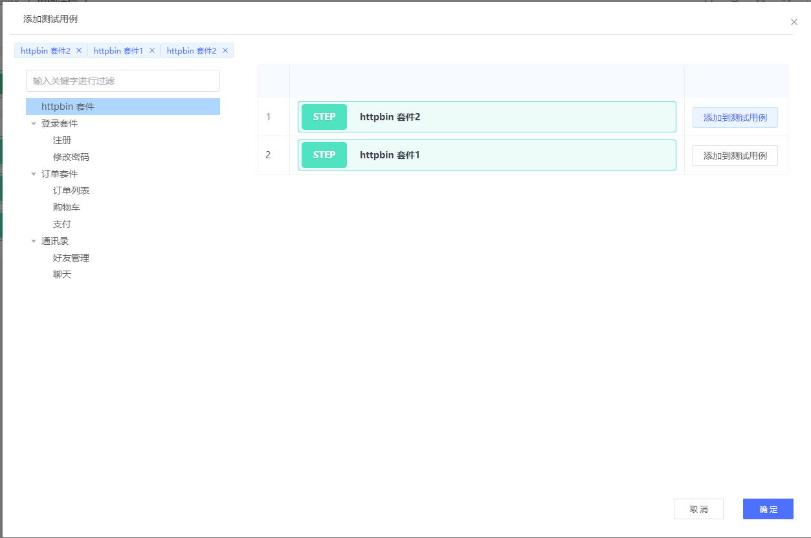

## 定时任务
1. 新建定时任务
2. 进入任务详情，在详情中添加用例，一个任务可以同时添加用例（一个用例可以被多次添加）
3. 在任务详情中调整用例执行顺序
4. 设置定时运行：在编辑窗口，通过时间配置来设置定时执行的时间，目前支持`每天`、`每周`、`每月`定时执行
5. 开启定时任务：`定时执行`为启用状态时，会根据设置定时执行的时间运行
6. 运行时，`测试步骤`、`测试用例`会以定时任务设置的`运行配置`执行

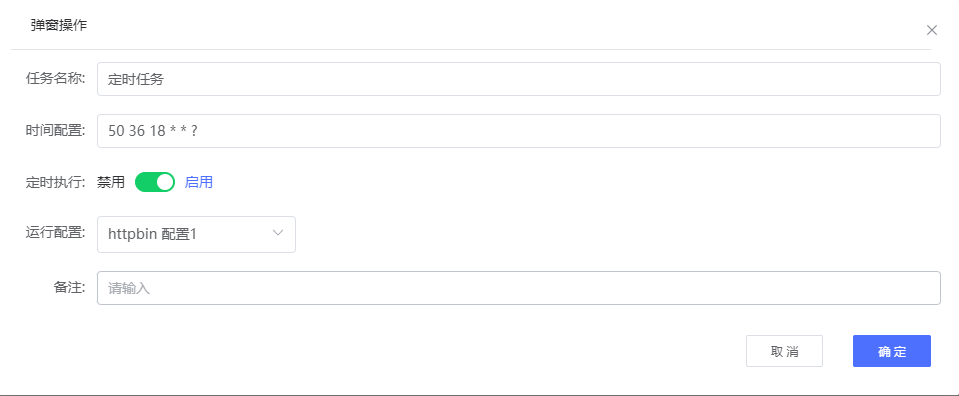
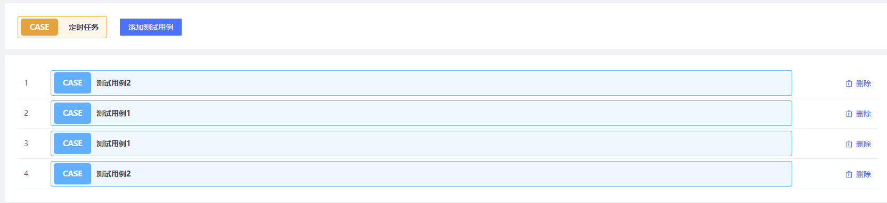
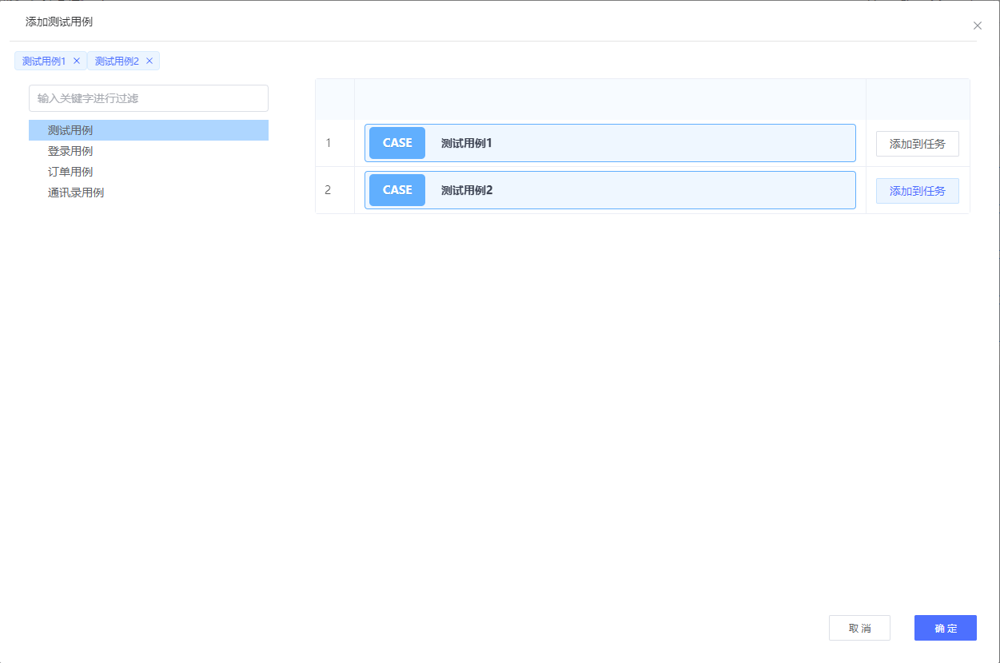

## 测试报告

### 用例类型
> api
> 步骤
> 用例
> 定时任务

### 执行类型
> 保存调试
> 调试运行
> 后台运行
> 定时运行

### 报告详情
用例名称
> api: api名称
> 步骤: 步骤名称
> 用例: 用例名称
> 定时任务: 用例名称 - 步骤名称

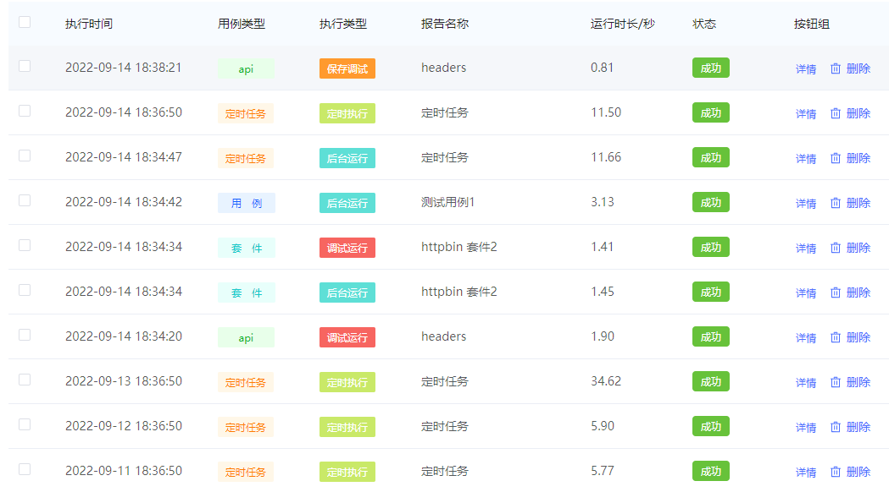
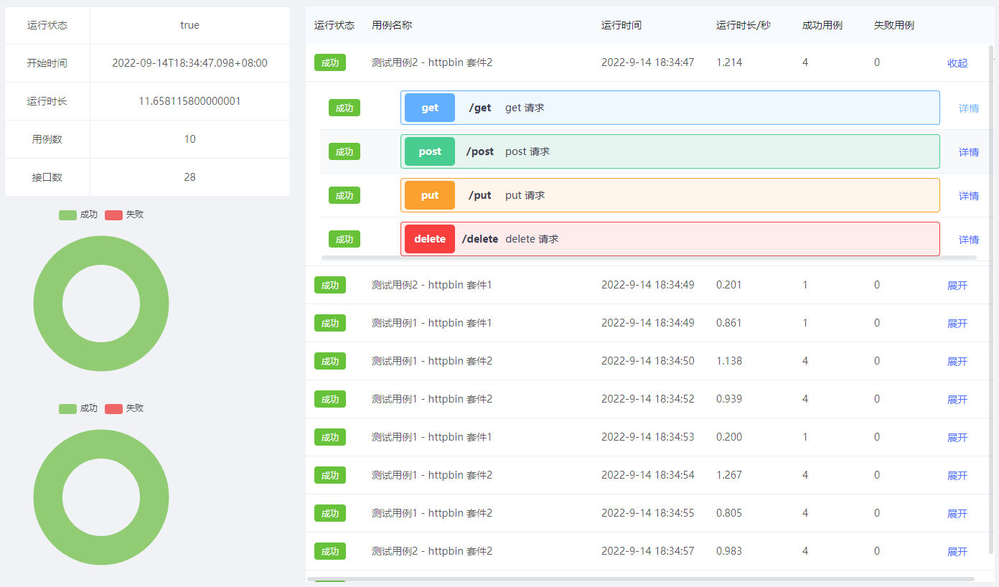
